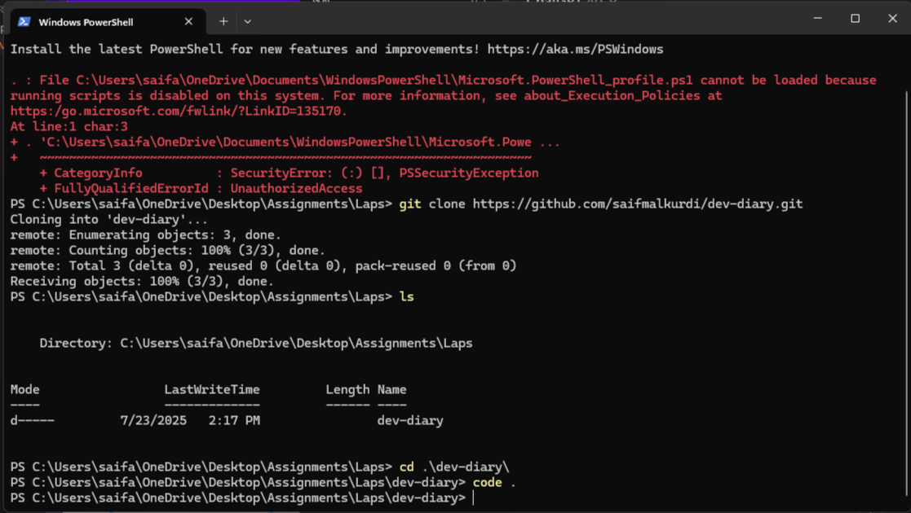

# My Dev-Diary

# 👋 Hello, I'm Saif Alkurdi

## 👨‍💻 About Me

  

I'm **Saif Alkurdi**, a passionate and motivated **Mechanical Engineer** turned **Full-Stack JavaScript Developer** from **Amman, Jordan**.  
I hold a Bachelor's degree in Mechanical Engineering from **Tafila Technical University**, and I’m currently leveling up my development skills as a student at **LTUC - ASAC**.

### 💻 Tech Stack I'm Learning:
- Frontend: `HTML`, `CSS`, `JavaScript`, `React`
- Backend: `Node.js`, `Express`, `MongoDB`
- Tools & Workflow: `Git`, `GitHub`, `VS Code`, `Postman`

---

## 🎯 Goals

- 🔭 Currently learning modern web development with a focus on **JavaScript full-stack applications**
- 🌱 Exploring best practices in clean code, performance, and accessibility
- 🤝 Looking to collaborate on open-source or learning-focused projects

---

## 📫 Connect with Me

- 📍 Based in Amman, Jordan
- 📧 Email: [saifalkurdi66@gmail.com](mailto:youremail@example.com)
- 💼 LinkedIn: [linkedin.com/in/saifalkurdi](https://www.linkedin.com/in/saifalkurdi)
- 🖥 GitHub: [github.com/saifmalkurdi](https://github.com/saifmalkurdi)

---

> "Engineering taught me how things work — coding taught me how to build my own."
> — Saif Alkurdi

## 🧠 Developer Mindset: What I Learned

After reading **"Learn the Fundamentals of a Good Developer Mindset in 15 Minutes"** I summarized the key lessons that will guide me on my journey as a developer:

---

### 🌱 Key Takeaways

- **Lifelong Learning:** The best developers never stop learning.
- **Break Down Problems:** Simplify big challenges into smaller.
- **Debug Like a Detective:** Approach bugs logically.
- **Growth Mindset:** Skills can be learned with practice.
- **Focus on Value:** Clean code is great, but software should solve real problems for users above all.
- **Keep It Simple:** Simple code is easier to read and maintain.
- **Plan for Maintenance:** Write future-friendly code with clear naming and small functions.
- **Design for Extensibility:** Anticipate future needs without overcomplicating current solutions.
- **Iterate with Feedback:** Involve users early. 
- **Collaborate Effectively:** Software is a team sport — and support your team.
- **Write Readable Code:** Code should be clean, understandable, and easy to maintain.
- **Automate Repetitive Tasks:** Save time with scripts and tools — your future self will thank you.
- **Done is Better Than Perfect:** Ship working solutions, then improve them based on real feedback.

---

## 🧪 Terminal Practice & What I Learned

Here’s a summary of the basic terminal commands I used to clone and open a GitHub project in VS Code.

### 🖼️ Screenshot of My Terminal

> 📍 This image shows the exact commands I used in PowerShell.

---

### 📚 Commands Explained

| Command | Purpose |
|--------|---------|
| `git clone https://github.com/saifmalkurdi/dev-diary.git` | Clones the GitHub repo into my current directory |
| `ls` | Lists files and folders in the current path |
| `cd .\dev-diary\` | Changes into the `dev-diary` folder |
| `code .` | Opens the current folder in Visual Studio Code |

---

### 📘 What I Learned from the Terminal Command Cheat Sheet

- `pwd`: Shows the current working directory (important for knowing where I am).
- `ls`: Lists all files and folders — helps visualize folder structure.
- `cd`: Lets me move between folders (e.g., into a project).
- `clear`: Clears the terminal screen for better visibility.
- `mkdir`: Creates a new directory.
- `touch` / `New-Item`: Creates new files quickly.
- `rm` / `del`: Removes files (careful!).
- `git clone`: Copies a GitHub repository to my local machine.
- `code .`: Opens current directory in Visual Studio Code.

